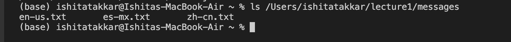
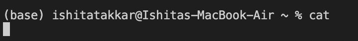
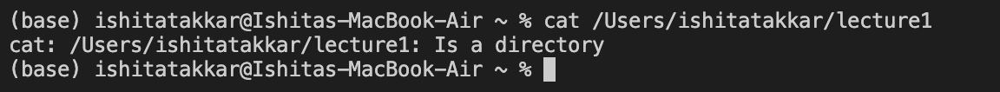
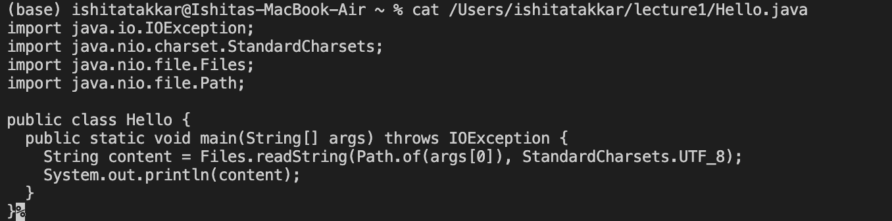

# *CSE15L LAB REPORTS*
***
## **Lab Report 1** 
***
1. For `cd` command:
   * *With no arguments*
     
     
     
     no error produced, remains in the current directory 
     Absolute path before : /Users/ishitatakkar
     

   * *With directory as argument*

     
     no error produced, changes current directory to lecture1
     Absolute path before : /Users/ishitatakkar/
     Absolute path after command :  /Users/ishitatakkar/lecture1

   * *With file as argument*

     
     error produced since cd works only to change directories and not to a file
     Absolute path before : /Users/ishitatakkar/lecture1
     Absolute path after command :  /Users/ishitatakkar/lecture1/Hello.java

2. For `ls` command:
   
   * *With no arguments*

     
     
     Running ls with no arguments lists the contents of the current directory
     No error is produced
     Absolute path before: /Users/ishitatakkar/

   * *With directory as argument*

     

     Returns list of files and directories in the specified directory
     which is lecture1

   * *With file as argument*

     

     Running this command lists information about the specified file.
     
3. For `cat` command:

   * *With no arguments*
     
     
     no error produced
     there is no output , it waits for input from standard input
     Absolute path before: /Users/ishitatakkar/

   * *With directory as argument*
  
     
     Absolute path before: /Users/ishitatakkar/
     attempts to concatenate the contents of a directory, which is not possible.

   * *With file as argument*

     
     Absolute path before: /Users/ishitatakkar/
     displays the contents of the specified file 
     
     
   

     
     
     
