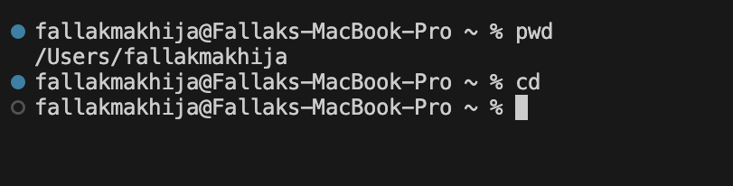
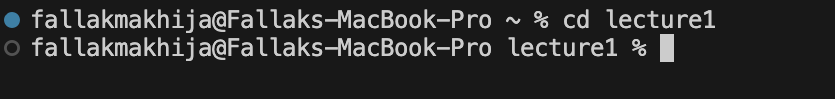
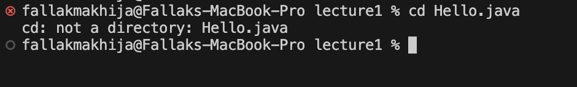
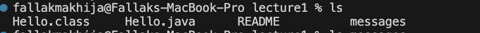
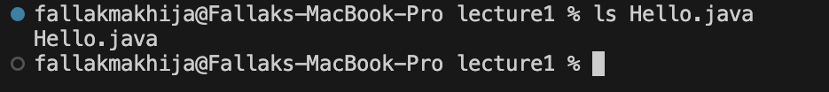
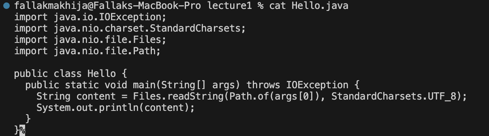

# *CSE15L LAB REPORTS*
***
## **Lab Report 1** 
***

1. For `cd` command:
   
   * *With no arguments*
     
     
     
     cd with no arguments does not do anything
      
     Absolute path before : `/Users/fallakmakhija`
     

   * *With directory as argument*

     
     
     no error produced, changes the current directory to `lecture1`
     
     Absolute path before : `/Users/fallakmakhija`
     
     Absolute path after command :  `/Users/fallakmakhija/lecture1`

   * *With file as argument*

     

     error produced since cd works only to change directories and not to file
     So, `cd Hello.java` produces error
     
     Absolute path before : `/Users/fallakmakhija/lecture1`
     
     Absolute path after command : `/Users/fallakmakhija/lecture1`

     

3. For `ls` command:
   
   * *With no arguments*

     
     
     Running ls with no arguments lists the contents of the current directory
     which is `lecture1`
     
     No error is produced
     
     Absolute path before: `/Users/fallakmakhija/lecture1`

   * *With directory `messages` as argument*

     

     Returns list of files and directories in the specified directory
     which is `messsages`
     
     No error produced
     
     Absolute path before: `/Users/fallakmakhija/lecture1`

   * *With file `Hello.java` as argument*

     

     Running this command lists the name of the itself
     In this case, it is `Hello.java`
     
     Absolute path before: `/Users/fallakmakhija/lecture1`

     
     
4. For `cat` command:

   * *With no arguments*
     
     
     
     no error produced,does not do anything
     
     there is no output , it waits for input from standard input
     
     Absolute path before: `/Users/fallakmakhija/lecture1`
     

   * *With directory `messages` as argument*
  
     
  
     Absolute path before: `/Users/fallakmakhija/lecture1`
     
     Error produced
     
     attempts to concatenate the contents of a directory `messages`, which is not possible.
     

   * *With file `Hello.java` as argument*

     
     
     Absolute path before: `/Users/fallakmakhija/lecture1`
  
     No error produced
     
     displays/prints the contents of the specified file `Hello.java` 
     
     
   

     
     
     
