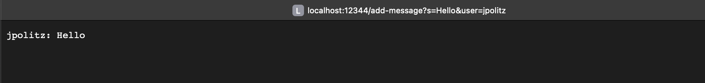
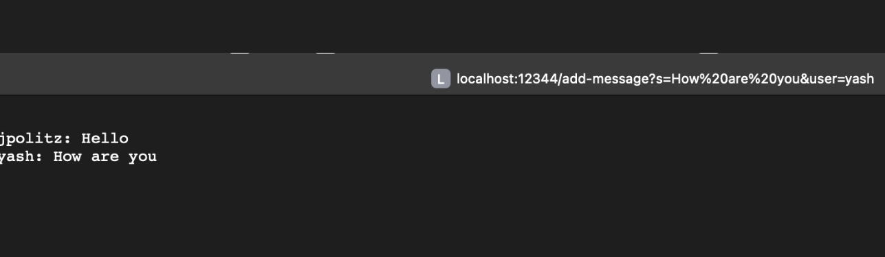
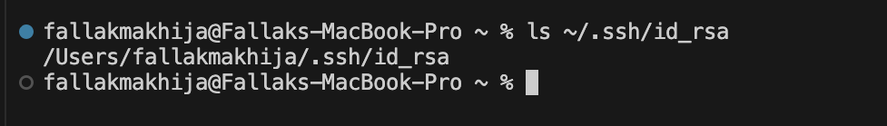
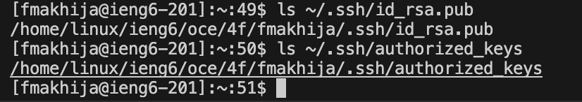
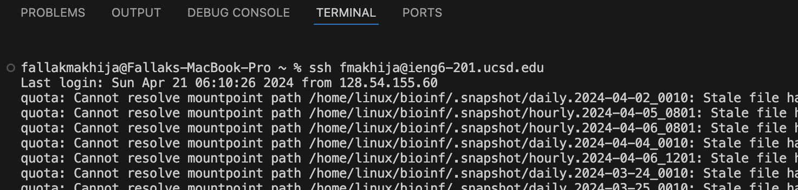

# *CSE15L LAB REPORTS*
***
## **Lab Report 2-Servers and SSH Keys (Week 3)** 
***

### **PART1-Building a ChatServer**
***

**CODE FOR `ChatServer` :**

```
import java.io.IOException;
import java.net.URI;
import java.util.ArrayList;
class Handler implements URLHandler{
    
    ArrayList<String> arr=new ArrayList<>();

    public String handleRequest(URI url){

        if(url.getPath().equals("/add-message")){
            String query=url.getQuery();
            String[] param = query.split("&");
            String messageParam = param[0];
            String userParam = param[1];

        if(messageParam.startsWith("s=") && userParam.startsWith("user=")){
        
                String message=messageParam.substring(2);
                String user=userParam.substring(5);
                arr.add(user+": "+message);
                return ChatHistory();
               
            }
        }
        return "404 Not Found!";
        
    }
    public String ChatHistory(){
        String allMessages="";
        for(String s:arr){
            allMessages+=s+"\n";
        }
        return allMessages;
    }
    

}

class ChatServer{
        public static void main(String[] args) throws IOException {
            if(args.length == 0){
                System.out.println("Missing port number! Try any number between 1024 to 49151");
                return;
            }
    
            int port = Integer.parseInt(args[0]);
    
            Server.start(port, new Handler());
        }
    }
      
```

**FIRST OUTPUT OF `/add-message`:**



#### Q1) Which methods in your code are called?
***
`handleRequest`:This method is in the `Handler` class and is called when the server receives a request to the` /add-message `path.

`ChatHistory`:This method is in the `Handler` class and is called within `handleRequest` to construct and return the full chat history after a new message is added.

`main`:This method is in the `ChatServer` class and it is the entry point of the ChatServer program. It is called when the server application is started.


#### Q2) What are the relevant arguments to those methods, and the values of any relevant fields of the class?
***
For the method `handleRequest(URI url)`:
The URI url part takes in a URL as the argument. The URL here would be https://localhost:12344/add-message?s=Hello&user=jpolitz.

For the method `ChatHistory()`: No arguments for this method. It iterates over the arr ArrayList filed to build the chat history.

For `main(String [] args)`: This method takes in the arguments from the command-line where args[0] is expected to be the port number on which the Server should listen.


#### Q3) How do the values of any relevant fields of the class change from this specific request? If no values got changed, explain why.
***

In the Handler class, the `arr ArrayList` field is initially empty but when it receives the request,
the `handleRequest` method parses the query and constructs the message "jpolitz: Hello" and adds it 
to the ArrayList arr. The following local variables get updated:

`query`:This variable will hold the full query string `s=Hello&user=jpolitz` extracted from the url.

`param`:This array will be populated with the split results of the query string ["s=Hello", "user=jpolitz"].

`messageParam`:This variable will hold the message part of the query, s=Hello.

`userParam`: This variable will hold the user part of the query, user=jpolitz.

`message`:After extracting the substring from messageParam, this will hold Hello.

`user`:After extracting the substring from userParam, this will hold jpolitz.

`allMessages`: This variable is in the ChatHistory method and is a string that starts as an empty string and accumulates all chat messages from the ArrayList arr. After the request, it will hold `jpolitz: Hello\n`. In the `ChatServer` class, the main method accepts the port number as args[0].


**SECOND OUTPUT OF `/add-message`:**




#### Q1) Which methods in your code are called?
***
`handleRequest`:This method is in the `Handler` class and is called when the server receives a request to the `/add-message` path.

`ChatHistory`:This method is in the `Handler class` and is called within handleRequest to construct and return the full chat history after a new message is added.

`main`:This method is in the `ChatServer` class and it is the entry point of the ChatServer program. It is called when the server application is started.


#### Q2) What are the relevant arguments to those methods, and the values of any relevant fields of the class?
***
For `handleRequest(URI url)`:The URI url part takes in a URL as the argument. The URL in this case would be https://localhost:12344/add-message?s=How%20are%20you&user=yash. 

For `ChatHistory()`: It iterates over the arr ArrayList filed to build the chat history. It has `jpolitz: Hello`saved in the array and then the next added message`yash: How are you` too, it returns both the strings stored with a line break in between. 

`For main(String [] args)`: This method takes in the arguments from the command-line where args[0] is expected to be the port number on which the Server should listen.


#### Q3) How do the values of any relevant fields of the class change from this specific request? If no values got changed, explain why.
***

In the Handler class, the `arr ArrayList` field is not empty upon receving the request, the `handleRequest` method parses the query and constructs the message `yash: How are you` and adds it to the ArrayList arr at the first index, whereas the older message is stored at the first index.

The following local variables are updated:

`query`:This variable will hold the full query string `s="How%20are%20you&user=yash"` extracted from the url.

`param`:This array will be populated with the split results of the query string `["s=How%20are%20you", "user=yash"]`.

`messageParam`:This variable will hold the message part of the query, `s=How%20are%20you`.

`userParam`: This variable will hold the user part of the query, `user=yash`.

`message`: After extracting the substring from messageParam, this will hold `"How are you"`.

`user`: After extracting the substring from userParam, this will hold `"yash"`.

`allMessages`: This variable is in the ChatHistory method and is a string that starts as an empty string and accumulates all chat messages from the ArrayList arr. After the request, it will hold `jpolitz: Hello\n`and `yash: How%20are%20you`. In the `ChatServer` class, the main method accepts the port number as args[0].

***


### **PART2- SSH Keys**
***

**ls with the absolute path to the `private key` for your `SSH key` for logging into `ieng6`**



**ls with the absolute path to the `public key` for your `SSH` key for logging into `ieng6`**



**A terminal interaction where you log into your `ieng6` account without being asked for a password**



***

### **PART3- What I Learnt**
***

During week2, I learnt about URLs and the different parts of a `URL`. I even learnt to create web servers.
Learning how to updater web pages using paths and queries was interesting. I also learnt about what a `port` is and what
ports people usually use to build websites(80 or 443).
Knowing and using the `curl` command was great.
In week3, I learnt about `ssh` keys and their usage in accessing into my course-specific account.
