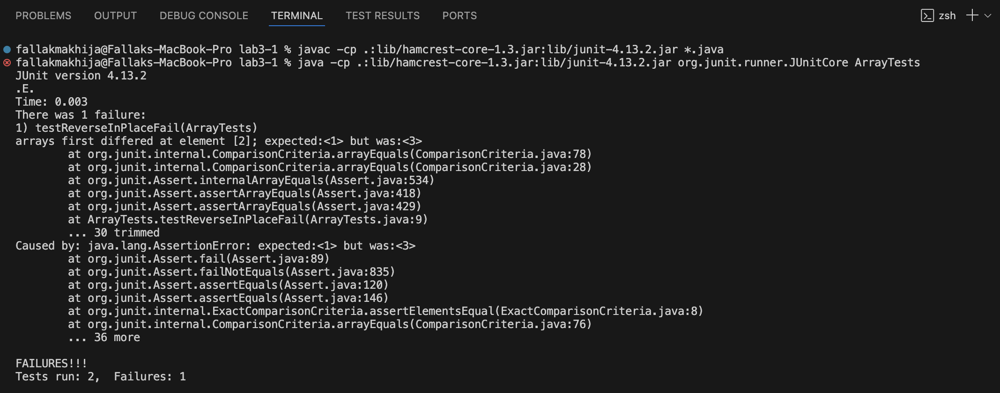

# Lab Report 3 - Bugs and Commands

## Part 1 - Bugs 

1. A failure-inducing input for the buggy program, as a JUnit test and any associated code (write it as a code block in Markdown)

    ```
    @Test 
    public void testReversedInPlaceFail() {
        int[] input1 = {1, 2, 3};
        ArrayExamples.reverseInPlace(input1);
        assertArrayEquals(new int[]{3, 2, 1}, input1);
    }
    ```


2. An input that doesn’t induce a failure, as a JUnit test and any associated code (write it as a code block in Markdown)


    ```
    @Test 
	public void testReverseInPlacePass() {
        int[] input1 = { 2 };
        ArrayExamples.reverseInPlace(input1);
        assertArrayEquals(new int[]{ 2 }, input1);
	}
    ```
3. The symptom, as the output of running the tests (provide it as a screenshot of running JUnit with at least the two inputs above)
   


5. a) Code before fixing bug:
```
static void reverseInPlace(int[] arr) {
    for(int i = 0; i < arr.length; i += 1) {
      arr[i] = arr[arr.length - i - 1];
    }
  }
```

4. b)  Code after fixing bug:
```
static void reverseInPlace(int[] arr) {
    int hold;
    for(int i = 0; i < (arr.length/2); i += 1) {
      hold = arr[i];
      arr[i] = arr[arr.length - i - 1];
      arr[arr.length - i - 1] = hold;
    }
  }
```

For the reverseInPlace() method, it was returning the original inputted array, not the new array that should be used for the reversed version of the input. Hence, a variable was created to hold the current value at the index and change the parameters for the for loop to stop once i is less than half of array’s length.
