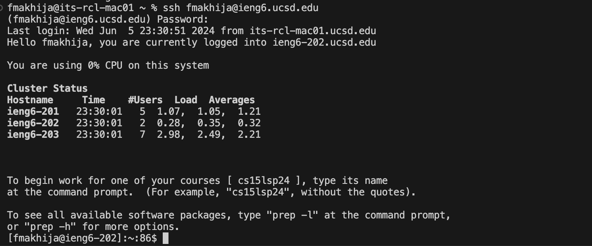

# CSE 15L Lab Report 4  - VIM

**Step 4:Log into ieng6**

* Keys Pressed:
`ssh<space>fmakhija@ieng6.ucsd.edu<enter>`

* Explanation:
I used the ssh command to log into the ieng6 server remotely, <enter> runs the command 

**Step 5:**

Keys Pressed:
`git<space>clone<Ctrl+V><enter>`

Explanation:
I git cloned the repository i had forked in an earlier step onto the ieng6 server I am now logged into.

**Step 6:**

Keys Pressed:
`cd<space>./l<tab><enter>`
`bash<space>t<tab><enter>`

Explanation:
I first changed the directory to be lab7 and then I ran the test script using `bash test.sh` and received the expected results.

**Step 7:**

Keys Pressed:
`vim<space>L<tab>.java`

Explanation:
I entered the ListExamples.java file using vim and then continued editing as explaned after the next screenshot.

Keys Pressed:
`:44<right><right><right><right><right>xi2<esc>:wq!`

Explanation:
I skipped to line 44(the desired line to edit), then I moved on top of the character I wanted to delete and used the command x to delete. I then enetered insert mode and inserted a 2, exited insert mode and ran `:wq!` to save and exit the file, the result of my edits before saving and quitting is shown below.

